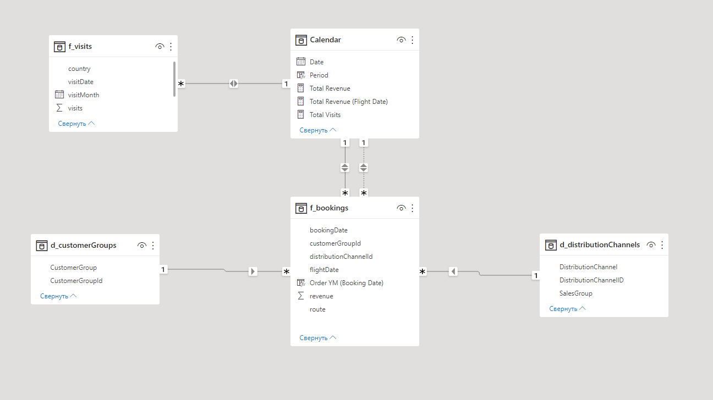

## Data processing
You can find implementations of data processor in classes BookingsProcessor (for "Bookings" entity) and VisitsProcessor (for "Visits" entity).

| ClassName | LinkToProcessor | LinkToTest |
| ------ | ------ | ------ |
| BookingsProcessor | [Link](https://github.com/garpuun/euwd-case-study/blob/develop/datawarehouse/src/main/java/org/example/processor/impl/BookingsProcessor.java) | [Link](https://github.com/garpuun/euwd-case-study/blob/develop/datawarehouse/src/test/java/org/example/processor/impl/BookingsProcessorTest.java) |
| VisitsProcessor | [Link](https://github.com/garpuun/euwd-case-study/blob/develop/datawarehouse/src/main/java/org/example/processor/impl/VisitsProcessor.java) | [Link](https://github.com/garpuun/euwd-case-study/blob/develop/datawarehouse/src/test/java/org/example/processor/impl/VisitsProcessorTest.java) |

I decided to store the data in datalake in parquet format for the following reasons:
- Native support in Spark
- Efficient storage in terms of storage space.
- It is essentially just files that are easy to move, copy and replicate.

I decided to use the gold layer in the datalake and save the aggregated data into it, it seems to me that the aggregated data Power BI will process faster, as it will not need to do additional calculations.

## Data Model

The data model consists of two aggregated fact tables (f_visits, f_bookings) and three dimension-tables (d_customerGroups, d_distributionChannels, Calendar).  
The table f_bookings has foreign keys to the tables d_customerGroups and d_distributionChannels (One to many relationships), and it also linked to the table Calendar by the fields bookingDate and flightDate.  

The Calendar table has been created by using function CALENDAR(MIN(f_bookings[bookingDate]), MAX(f_bookings[flightDate])), finds the minimum date of booking and maximum date of flight and creates a calendar with the detected date range.  
This is done so that we can use the common date slicer in the report.
Similarly, the f_visits table is linked to the Calendar table by the visitDate field.

## Creating Measures

To calculate revenue by bookingDate, I created a measure in the Calendar table using function SUM(f_bookings[revenue]).  

To calculate revenue by flightDate - CALCULATE(SUM(f_bookings[revenue]), USERELATIONSHIP('Calendar'[Date], f_bookings[flightDate])) also in Calendar.  
I used function USERELATIONSHIP because there is no active USERELATIONSHIP in the data model between flightDate(f_bookings) and Date(Calendar), with function USERELATIONSHIP we can use that relationship.  

To calculate total number visits - SUM(f_visits[visits]).

